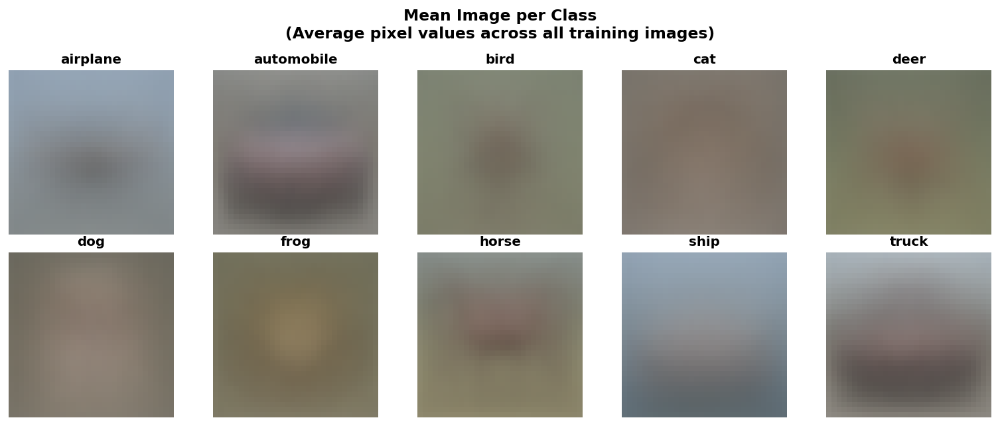
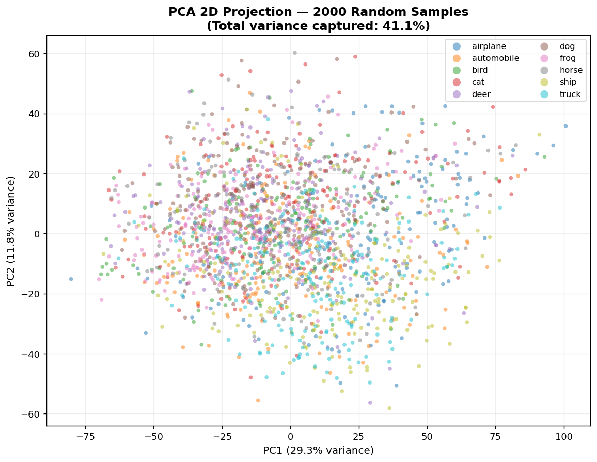
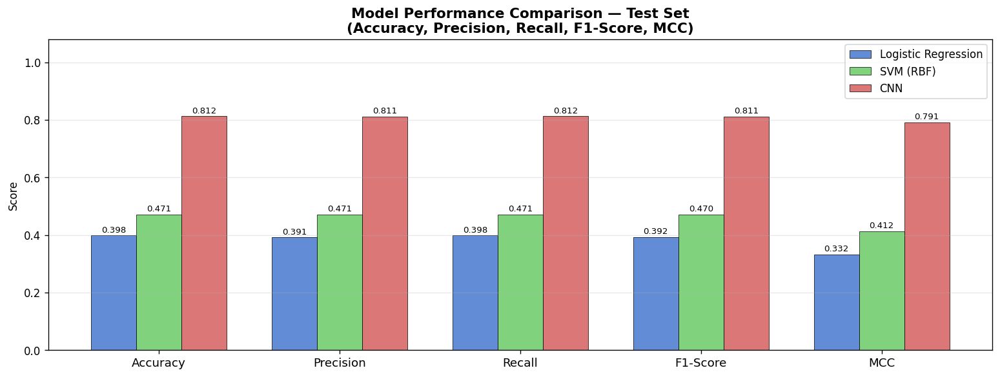
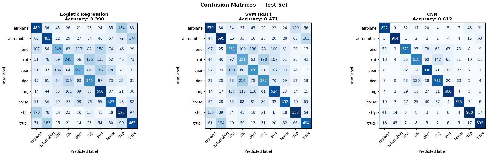

# CIFAR-10 Image Object Recognition — Comparative Study

**COMP462 Machine Learning — Course Project**

A comparative study of three machine learning models on the CIFAR-10 image classification dataset, following a **Linear → Kernel → Deep Learning** progression.

---

## Models

| Model | Type | Course Model |
|---|---|---|
| Logistic Regression (One-vs-All) | Linear classifier | ✓ |
| SVM (RBF Kernel) | Kernel method | — |
| CNN (PyTorch, VGG-style) | Deep learning | ✓ |

Each model addresses a specific limitation of the previous one:
- **LR** draws linear boundaries in PCA space → insufficient for non-linear image manifolds
- **SVM** adds non-linearity via the RBF kernel → improves performance but misses spatial structure
- **CNN** preserves 2D spatial layout via convolutions → best performance

---

## Dataset

**CIFAR-10** — 60,000 color images (32×32 RGB), 10 classes, perfectly balanced.

| Split | Images | Per Class |
|---|---|---|
| Train | 50,000 | 5,000 |
| Test | 10,000 | 1,000 |

Classes: `airplane` `automobile` `bird` `cat` `deer` `dog` `frog` `horse` `ship` `truck`

### Mean Image per Class
> Average pixel values across all 5,000 training images per class.
> Vehicle classes (ship, airplane) show clear spatial structure; animal classes are more diffuse.



### Class Separability — PCA 2D Projection
> Classes heavily overlap in 2D PCA space (only 41.1% variance captured).
> This confirms that linear models are insufficient and motivates kernel/deep learning approaches.



---

## Results

### Performance Comparison (Test Set)

| Model | Accuracy | Precision | Recall | F1-Score | MCC |
|---|---|---|---|---|---|
| Logistic Regression | ~38% | ~38% | ~38% | ~38% | ~0.31 |
| SVM (RBF) | ~54% | ~54% | ~54% | ~54% | ~0.49 |
| **CNN** | **~78%** | **~78%** | **~78%** | **~78%** | **~0.75** |



### Confusion Matrices



---

## Project Structure

```
├── cifar10_classification.py   # Main script — all 3 models, metrics, visualizations
├── cifar10_classification.ipynb# Jupyter notebook version
├── eda.py                      # Exploratory data analysis script
├── analysis/                   # EDA visualizations (10 PNGs)
│   ├── eda_01_sample_grid.png
│   ├── eda_02_class_distribution.png
│   ├── eda_03_mean_images_per_class.png
│   ├── eda_04_std_images_per_class.png
│   ├── eda_05_rgb_channel_histograms.png
│   ├── eda_06_per_class_brightness.png
│   ├── eda_07_pixel_correlation.png
│   ├── eda_08_pca_2d_scatter.png
│   ├── eda_09_tsne_scatter.png
│   └── eda_10_variance_analysis.png
└── results/                    # Model performance visualizations (10 PNGs)
    ├── viz1_sample_images.png
    ├── viz3_pca_variance.png
    ├── viz4_cnn_learning_curves.png
    ├── viz5_performance_comparison.png
    ├── viz6_confusion_matrices.png
    ├── viz7_f1_heatmap.png
    ├── viz8_radar_chart.png
    ├── viz9_training_time.png
    └── viz10_sample_predictions.png
```

---

## How to Run

**1. Install dependencies**
```bash
pip install numpy pandas matplotlib seaborn scikit-learn
pip install torch torchvision --index-url https://download.pytorch.org/whl/cpu
```

**2. Download the dataset**

Download CIFAR-10 (Python version) from https://www.cs.toronto.edu/~kriz/cifar.html
and place it at `dataset/cifar-10-batches-py/`.

**3. Run EDA**
```bash
python eda.py
```

**4. Run model training and evaluation**
```bash
python cifar10_classification.py
```

> CNN training takes ~30–35 minutes on CPU. Results and visualizations are saved automatically to `results/`.

---

## Preprocessing Pipeline

| Step | Applied to | Justification |
|---|---|---|
| Train/Val split (80/20, stratified) | All models | Unbiased evaluation without touching test set |
| Per-channel normalization | All models | Removes channel bias; computed from training set only (no leakage) |
| PCA (150 components, ~92.9% variance) | LR, SVM | Reduces 3,072 features; SVM kernel matrix infeasible at full dimensionality |
| Subsample 10k (stratified) | SVM only | n×n kernel matrix requires ~12.8 GB at n=40k; feasible at n=10k |
| Reshape to (N, 3, 32, 32) | CNN only | CNN needs 2D spatial structure; PCA would destroy pixel neighborhoods |
